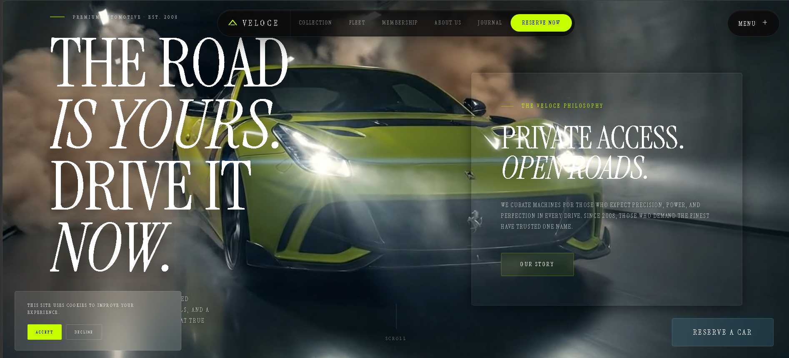
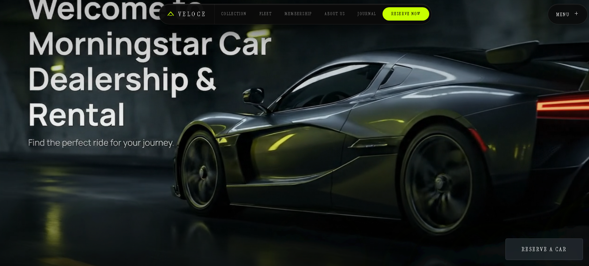
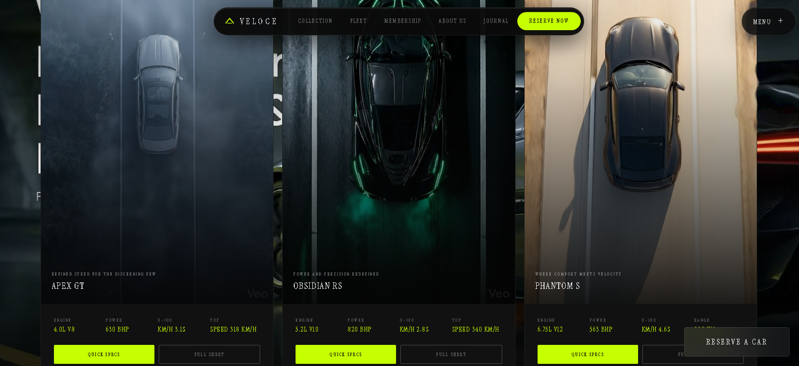

# ⚡ VELOCE — Premium Automotive Club

> A cinematic luxury car dealership & rental web experience.
> Dark UI. Neon-green accents. Animated everything.



---

## 🔗 Live Demo

**[veloce — Premium Automotive Club](https://car-dealership-mark1.vercel.app/)**

---

## 📸 Screenshots

| Hero | Experiences | Fleet |
|------|-------------|-------|
|  |  |  |

---

## 🧠 What Is Veloce?

Veloce is a fully deployed, production-grade luxury automotive platform —
built as a premium car dealership and rental experience.

The name means **speed** in Italian. The goal was simple: build something
that *feels* like a real luxury brand the moment you land on it.

Not a template. Not a theme. Every section designed from scratch with a
clear aesthetic vision — cinematic dark backgrounds, editorial typography,
glass-morphism cards, and animations that move with intention.

---

## ✨ Features

- **Cinematic Hero Section** — fixed video background, staggered text
  reveal animations, scroll indicator
- **GSAP Staggered Menu** — side panel with prelayer wipe animation
  and nav item stagger
- **Fleet Overlay** — three full-screen car panels opening simultaneously
  with blur effect on hero
- **Car Specs Grid** — portrait-ratio video cards with hover zoom,
  stat grids, sliding spec drawer
- **Brand Manifesto Section** — full-opacity video background,
  glass-morphism card, right-aligned
- **Experiences Section** — video background, animated service cards
- **Membership Tiers** — three-tier card system with sticky interior
  video panel
- **Veloce Academy** — module grid with animated progress bars
- **Booking Form** — full reservation form with input validation
- **FAQ Accordion** — animated open/close with smooth height transitions
- **Testimonials Rail** — horizontal scroll snap with staggered entrance
- **Page Overlays** — full-screen animated panels for Journal,
  Collection, Membership, About
- **Ripple Trail Effect** — custom mouse particle system with SVG
  liquid displacement filter
- **Cookie Consent** — animated bottom-left glass banner
- **Custom Cursor** — dot cursor with animated ring follow
- **Scroll-triggered Animations** — fade-up reveals on every section

---

## 🛠️ Tech Stack

### Frontend
| Tool | Purpose |
|------|---------|
| React 19 | UI framework |
| TypeScript | Type safety |
| Vite | Build tool & dev server |
| Tailwind CSS v4 | Utility-first styling |
| Framer Motion (motion/react) | Scroll & entrance animations |
| GSAP | Staggered menu animation only |
| Instrument Serif | Display typography via Google Fonts |

### Deployment
| Tool | Purpose |
|------|---------|
| Vercel | Hosting & deployment |
| GitHub | Version control |

---

## 📁 Project Structure
Car_dealership_mark1/
├── Car_Dealership_mark2/     ← subfolder
├── Car_dealership_mark1/     ← subfolder  
├── dist/                     ← build output
├── public/                   ← static assets
├── src/                      ← source code
├── .gitignore
├── index.html
├── npm
├── package-lock.json
├── package.json
├── tsconfig.json
├── tsconfig.tsbuildinfo
├── vercel.json
└── vite.config.ts

---

## 🚗 The Fleet

| Model | Engine | Power | 0–100 | Top Speed |
|-------|--------|-------|-------|-----------|
| **Apex GT** | 4.0L V8 | 630 BHP | 3.1s | 318 km/h |
| **Obsidian RS** | 5.2L V10 | 820 BHP | 2.8s | 340 km/h |
| **Phantom S** | 6.75L V12 | 563 BHP | 4.6s | 250 km/h |

---

## ⚙️ Getting Started

### Prerequisites

- Node.js 18+
- npm

### Installation

```bash
# Clone the repository
git clone https://github.com/Rakshit0229/Car_dealership_mark1.git

# Navigate into the project
cd Car_dealership_mark1

# Install dependencies
npm install

# Start development server
npm run dev
```

### Build for Production

```bash
npm run build
```

### Preview Production Build

```bash
npm run preview
```

---

## 🎬 Video Assets

The project requires 9 MP4 video files placed in `public/videos/`.
These are not included in the repository due to file size constraints.

| File | Section |
|------|---------|
| `hero-bg.mp4` | Hero fixed background |
| `manifesto-bg.mp4` | Brand Manifesto background |
| `experiences-bg.mp4` | Experiences section background |
| `fleet-apex-gt.mp4` | Fleet card + overlay panel 1 |
| `fleet-obsidian-rs.mp4` | Fleet card + overlay panel 2 |
| `fleet-phantom-s.mp4` | Fleet card + overlay panel 3 |
| `academy-bg.mp4` | Academy section background |
| `interior-tour.mp4` | Membership sticky video panel |
| `workshop-bg.mp4` | Footer background |

---

## 🎨 Design System

```css
--bg-base:    #0a0a0a    /* Near-black base */
--bg-surface: #111111    /* Elevated surface */
--accent:     #C6FF00    /* Neon lime green */
--text:       #f0f0f0    /* Primary text */
--font:       'Instrument Serif', ui-serif, serif
```

**Typography:** Instrument Serif — regular + italic
**Core easing:** `cubic-bezier(0.19, 1, 0.22, 1)` — the luxury ease
**Glass effects:** `backdrop-filter: blur() saturate()` on dark surfaces
**Animation library split:** Framer Motion for everything, GSAP only
for the staggered menu sequence

---

## 🧩 Key Design Decisions

**No overlays on video sections** — BrandManifesto, Experiences, and
Academy play at full opacity. Only glass cards carry the frosting.
This lets the cinematics breathe without being buried under dark divs.

**Two independent navbar elements** — The centered pill navbar and the
top-right MENU button are two completely separate components. They
shift position independently when the fleet overlay or side menu opens.

**Portrait car cards** — Fleet cards use 9:16 aspect ratio, treating
each car like editorial photography rather than a product thumbnail.

**GSAP scoped to one component** — Every animation uses Framer Motion
except the StaggeredMenu, which uses GSAP for the prelayer wipe
sequence. This keeps the animation bundle clean and intentional.

**Fixed hero, scrollable content** — The hero video and text are fixed
to the viewport. A spacer div holds the scroll position while content
slides over the top — creating a parallax-style reveal without
any parallax library.

---

## 📦 Dependencies

```json
{
  "dependencies": {
    "gsap": "^3.14.2",
    "motion": "^12.38.0",
    "react": "^19.2.4",
    "react-dom": "^19.2.4",
    "tailwindcss": "^4.2.2",
    "tw-animate-css": "^1.4.0"
  },
  "devDependencies": {
    "@tailwindcss/vite": "^4.2.2",
    "@types/react": "^19.1.6",
    "@types/react-dom": "^19.1.5",
    "@vitejs/plugin-react": "^4.5.2",
    "typescript": "~5.8.3",
    "vite": "^6.3.5"
  }
}
```

---

## 🚀 Deployment

Deployed on **Vercel** via GitHub integration.
Every push to `main` triggers an automatic production deployment.

**Live:** [https://car-dealership-mark1.vercel.app/](https://car-dealership-mark1.vercel.app/)

---

## 📄 License

MIT — free to use as reference or inspiration.
If you build something with it, drop a star ⭐ and tag me.

---

## 🙏 Built With

- **Anthropic Claude** — AI pair programmer throughout the build
- **Google Fonts** — Instrument Serif typography
- **Vercel** — Deployment and hosting
- **GitHub** — Version control

---

*Veloce. Speed, by design.*
